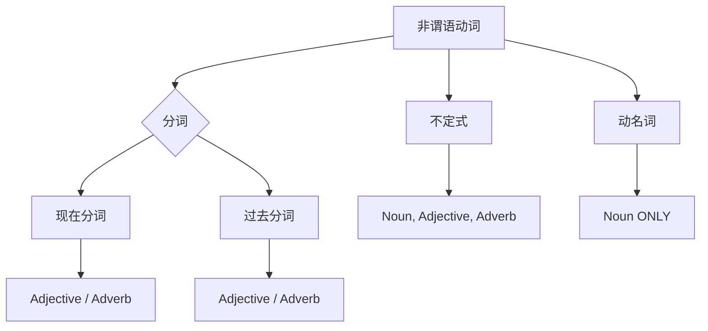

# Part 1 语法

## 1. 主语从句

作主语的从句, 叫主语从句【句子做主语, 这一个整句的谓语动词要用单数】

定义：说白了，在主语本身就是一个从句。（从句也是句，从句本身也有着它的主语、谓语和宾语）主语从句分两类：

① how/what/when/why/whether/who等常见的信号词引导的主语从句：

A. What is the most important thing for you does not hold true for others.  
B. When you play soccer is not decided.  
C. How you play soccer is good.  
D. Whether you play soccer is unknown.  
E. Who you like is him.  
F. Who hates you is him.

② that 引导的主语从句（that 在从句里本身不做任何成分且无意义，但它起到了构成主语从句的功能），that 之后是一个完整句。句型：That+句子+谓语+宾语

例句：

That you play tennis (完整句) is interesting. “你打网球这件事情很有趣。”

That these books are good is interesting. "These 书是好的这件事情很有趣"

特别记忆

How to play soccer is a question. “how to do sth”这个结构可以用来做主语。

关系连词（what how 等等后面加动词不定式 to do 可以看成是从句的省略）

Eg: I know how to do this. I understand what to do.

注意：写完主语从句之后，整个句子的谓语动词应该是主语从句发出的，而不是主语从句里的某个单词。  

写作思维：

A. 教我们的老师是一个不错的老师，教我们英语的那个人是不错的

Who taught English for you is good.

B. 这张图里展示了，这张图里展示的东西是…

What this picture shows us is...

C. 这个现象提升了我们国家的环境

This phenomenon improves our environment  $\rightarrow$  What this phenomenon can do is to improve our environment.

作文好句：

What the chart above clearly mirrors is an upward trend about the level of health literacy for residents in our country. (图表题开头)

## 2.Therebe句型：

There be N.（定语）有...

常见搭配

① There is a book interesting. (形容词)  
② There is a book that is useful. (定从)  
③ There is a book making me happy. (非谓语)  
④ There is a book in my school (介词短语)  
⑤ There is a book, a too! that is useful. (同位语)  
⑥ There is an idea that I can play soccer. (同位语从句)

写作思维：there be + N，N 学会用抽象名词（例如 importance, steadiness, an idea, danger）我的这本书很重要  $\rightarrow$ 有很多的重要性在这本书里对于我

This book is important for me.  $\rightarrow$  There is much importance in this book for me.

A. The trend is steady.  $\rightarrow$  There is much steadiness in this trend.  
B. I think that I like you.  $\rightarrow$  There is an idea from me that I like you.  
C. Sth is dangerous.  $\rightarrow$  There is danger in sth.

积累

A.There is no N.即：没有……
B. There might be N. 即：可能有……  
C. There is going to be N. 即：将会有……  
D. There exist N. 即: 有……  
E. There was/were/have been/had been N.

作文好句

There are two fundamental factors contributing to this phenomenon.

## 3. So that/such that 句型

如此...以至于...(递进关系)

① so adj./adv. that 完整句子，adj 可以后置，adj/adv 要与前面的内容和语法相联  
(√) There is an apple so delicious that I want to eat it.  
(x)  I am so well that I can do this. Well 一般是副词，不能跟 be 动词  
(√) I fell so well that I can do this.  
(√) This happened, so quickly that I want to eat it.  

②  Such N.that完整句子，N在哪里要看具体句子放在哪里

A. This is such a perfect book that I want to read it.  
B. I am happy today because I earned such a great bag today that I am thrilled. (原因状语)  
C. It is important to have such a great book that I can read it every day. (形式主语)

③  So that连在一起:句子1 so that 句子2. 句子1和句子2之间是递进关系，所以翻译成“以至于”

There are so many apples so that there is no other fruit.

作文好句

A number of youngsters are so fanatical that they might ignore genuine qualities that ought to be cultivated, like perseverance, integrity and practicality.

## 4. 形式主语和形式宾语句型

形式主语

1. It is adj for sb to do sth.

注意：it 没有意思；adj 能不能形容这个 to do sth

A. It is convenient for us to use laptop.

B. It is exciting for me to play soccer.

2. It is adj. that 完整句子

It is useful for me that I can read books.

3. It seems that 完整句子

It seems as if you are ok.

It is likely that 完整句子

4. 不是所有的 it 打头的句子都是形式主语的

It can make me happy.

形式宾语

Make/leave it for sb to do sth. It 代替的是后面的 to do

A. I can make you a player.

B.I want to make it become more and more popular to play soccer in our nation.

注意：除了 "make" 和 "leave"，其他动词如 "find", "consider", "think", "believe", "deem" 等也可以用于此结构，尤其当表达对某事物的看法或判断时。
例句：
- I find it difficult to wake up early. (我发现早起很难。)
- We consider it our duty to help. (我们认为帮助是我们的职责。)

作文好句

It is advisable to stick to our own beliefs and keep going no matter how many difficulties and drawbacks/ handicaps we will face.

## 5. 非谓语动词句型

含义理解：非谓语动词也是动词的意思，有动词就会有主语，只有这句话出现了谓语才会有非谓语；注意，构成句子的时候一定要先想主句，再想非谓语。非谓语主动用现在分词（V+ing），被动用过去分词（V+ed）。

句型：

1. 非谓语+宾语+主谓宾（前置的非谓语通常是先发生的，非谓语的主语通常是主句的主语）

Reading this book, my teacher is happy.

2. 主谓宾+非谓语+宾语（后置的非谓语用逗号隔开，主语可以是前面的整句话）

There are many spectators watching the DT show, suggesting that Chinese cultures are becoming more and more popular.

3. 推荐句型：主语+定语(非谓语)+谓语+宾语

My teacher, almost overwhelmed by her projects, will have some time to do sth.

作文好句

From my perspective, the meaning conveyed in that drawing seems that persistence should be regarded as a pivotal character in our lifetime.

### 非谓语动词

非谓语动词共有三种形式，它们在句子中不能单独作谓语，而是根据其不同的“目的”或“功能”，承担其他句子成分。

**1. 不定式 (Infinitive): `to + 动词原形`**
   - **目的/功能:** 可作名词、形容词、副词，功能最多样。
   - **作名词:** `To learn is important.` (目的：将“学习”这个动作名词化，作为主语)
   - **作形容词:** `I have a promise to keep.` (目的：修饰名词 `promise`)
   - **作副词:** `He works hard to succeed.` (目的：说明主句动作 `works hard` 的目的)

**2. 动名词 (Gerund): `V-ing` 形式**
   - **目的/功能:** 其唯一目的是充当 **名词**。它强调动作本身，像一件“事情”。
   - **作主语:** `Reading is fun.` (将“阅读”作为一件事，来做主语。)
   - **作宾语:** `I enjoy reading.` (作为动词 `enjoy` 的宾语。)
   - **核心区别:** 动名词(Gerund)和现在分词(Present Participle)虽然形式都可能是`V-ing`，但功能完全不同。动名词是名词，而现在分词是形容词或副词。

**3. 分词 (Participle): 包括现在分词和过去分词**
   - **目的/功能:** 其主要目的是充当 **形容词** 或 **副词**，用来描述或修饰。

   - **A. 现在分词 (Present Participle): `V-ing` 形式**
     - **核心含义:** 表示“主动”和“进行”。
     - **作形容词 (定语):** `a developing country` (一个正在发展中的国家)
     - **作副词 (状语):** `Seeing the police, the thief ran away.` (提供主句动作发生的时间背景)

   - **B. 过去分词 (Past Participle): `V-ed` 形式**
     - **核心含义:** 表示“被动”或“完成”。
     - **作形容词 (定语):** `a broken window` (一扇被打破的窗户)
     - **作副词 (状语):** `Seen from space, the Earth is blue.` (从太空被看，地球是蓝色的。)

## 6. 动名词作主语

含义理解：动名词做主语的运用：当你想表达：“做一件事情，做这件事情是怎么怎么样”时，那就可以去使用动名词做主语。动名词是“doing”，动名词本身可能带着一个宾语，“动名词+宾语”这个结构本身看作是这个句子的主语，因为主语是“做……”这件事，谓语动词便是用单数，最后再加个宾语。这里的宾语依旧可以存在套娃现象。

句型：主语（Ving+宾语） +谓语动词（单数）+宾语  
注意动名词构成的主语跟后面的谓语跟宾语能不能搭配

(×) Producing computers from China is interesting. Producing 这个动作本身没办法发出 interesting

(√) Learning quietly in our library makes me happy.

作文好句

Realizing what we are skilled in and finding others' advantages are crucial for us to cooperate with people.

## 7. 宾语从句：

含义理解：“主谓宾”，宾语的位置上是一个从句，做宾语的从句，叫做宾语从句）由关系连词引导，关系连词之后仍是一完整句。  
例句：I think that I like to play soccer.  

> 写作提示：写作时，宾语从句的that不要省略；that之后有一套完整的主谓宾，阅读时要小心that可能省略。  

写作好句：

The caption indicates that only through innovation can we make progress while sticking to old ways is regression.

## 8. 状语从句：

含义理解：作状语的从句叫状语从句，状语从句的本质是在修饰动词

句型：关系连词+分句（主谓宾），主句（主句有一套完整的主谓宾）或主句（主谓宾），关系连词+分句（主谓宾）

翻译：即在[关系连词+分句]的情况之下，主句里的谓语动词发出了。即主句的谓语动词发出的条件是“关系连词+分句”。

例句：When I was in school, I can play soccer. 这里“play”发出的条件是“When I was in school”, 也就是说只有过去我在学校的时候我才能踢足球，其他时候不能。

注意：

1. while:

  1. 分句里有“进行时”时，这个“while”一般是“当”的意思。  
  2. 分句里没有“进行时”时, 这个“while”一般是“尽管”的意思=although

2. although/though/while:

xxxxxx[核心], though xxxxxx 为求翻译速读这里的“though”可翻译为“尽管”。与这个“三”词紧密相连的为非核心内容，作者主要想表达的意思是在前面。Although dsaidhasdasjd, dsahdasjda “尽管……，但是……”

3. as 

    1. as 作介词, 即翻译为“作为”——as+n. (as 后面接名词, 那就翻译为 “作为”)
    2. as 作连词：as+句子，有三个意思：
    
        1. 译为“当/随着……”
           *   **与 `while` 的区别:** `while` 在表示“当……时”时，通常要求从句使用进行时态（V-ing），强调持续的背景动作。而 `as` 在此含义下，可以使用简单时态（表示渐进变化或同时发生的短暂动作）或进行时态（与 `while` 类似，但不如 `while` 强调持续性）。
           *   **例:** `As the day ended, the air grew colder.` (渐进变化，简单时态)
           *   **例:** `As he opened the door, he saw a package.` (同时发生的短暂动作，简单时态)
           *   **例:** `As I was walking down the street, I saw my friend.` (持续动作，进行时态，与 `while` 类似)
        2.  译为“因为”，其结构为：主句（主句描述一个现象），asxxxxxx(现象产生的原因）例句：我们的社会进步了，因为……。  
        3. “as”译为“正如”，结构：as sb/sth v.该结构通常置于句首或是当插入语。

    3. 补充：“as...as”结构

1）该结构的翻译方法：把第一个as忽略，第二个as翻译成正如。 例句：This city is as beautiful as shanghai. 这个城市是美丽的正如上海。  
2)写作提示：就算抹除第一个as,剩余的整个句子也必须符合语法。

【错误例句】This school grows as beautiful as that school.

错因分析：当我们将第一个as抹除，剩余部分则为：This school grows beautiful as that school.这个“beautiful”显然是无法修饰“grows”的。故而我们写出正确例句：

This school grows as beautifully as that school.

总结：当你要写“as adj. as”这个结构时，你要确保这个 adj. 修饰的一定是名词，也要让阅卷老师知道是修饰哪个名词的。同理，如果中间是副词，或者其他意群，也要和前面语法相连。

例句：This city is as beautiful as shanghai.

作文好句：

While there are concerns about the potential negative impacts of studying abroad for Chinese teenagers, I believe that the benefits far outweigh the drawbacks.

## 9. 定语从句：

含义理解：作定语的从句叫定语从句，其本质是形容词，写定语从句，一定要去想这个定语从句修饰哪个词。定语从句——本质是修饰名词，状语从句——本质是修饰动词  
句型

A. 句型 1: n+who/which/whose+n2/that+不完整的句子（需要 n 做从句中的主语或者宾语；whom 只能做宾语）  

B. 句型 2: n+when/where/why+完整句子 (n 是时间名词用 when, 地点名词用 where, 原因则用 why, n 需要变成从句的状语)

I can go to Shanghai, where I have many books.

I like December, when I can play soccer.

The reason why I like Spring is that flowers are beautiful at that time.

C. 句型 3: “介词+which+完整的句子”

1) 带介词的定语从句，在这种情况之下的定语从句不会去修饰一个句子。在“介词+which”之后是一个完整的句子。  
2) 该结构的定语从句的翻译思路：

第一步：把介词本身的意思理解了。

第二步：把“which”替换成“被修饰的词”

例句：I like this book on which there is an apple. 我喜欢这本书在这本书上有一个苹果

作文好句

A. What is portrayed in the drawing above is a hot pot in which there are many cultural ingredients, including Lao She, Einstein and Shakespeare.

## 10.同位语从句：

含义理解：同位语的本质是用来解释名词的内容（所解释的名词，以抽象名词占绝大多数，通常是“有内容”的词）。  

同位语从句只能用 that 引导，且 that 之后是一个完整的句子。

I like this school that
I like this idea/opinion/new/story that......

• 要注意同位语从句与定语从句的区别，要能够区分开，例如：

I like this piece of news that is fresh. [定语从句]这条新闻是新鲜的

I like this piece of news that I can read books. [同位语从句]新闻的内容是我可以读书。

作文好句

The drawing depicts a phenomenon that cultures from different countries are interacting with each other.

## 11. 强调句

形式1：It is ... that ...

当我们去掉“It is”和“that”,剩下的部分合在一起依旧可以是一个完整的句子。

例句：It is my school that has this computer.

形式2：do + 动词原形（就强调这个动词的动作）

“do + 动词原形”这个结构中的“do”受时态影响。

例句：

I do like this book. “我确实喜欢这本书。”

I did like this book. “我过去确实喜欢这本书。”

写作提示：强调句强调状语从句的分句。（要强调什么，就把什么置于it is和that之间）

原句：When I was a kid, I could play soccer.
强调句：It is when I was a kid that I could play soccer.

使用强调句, 最好前面有语境或者一个范围, 然后在这个范围里, 强调某物

写作好句

It is indeed through lifelong learning that we can maintain our curiosity and thirst for knowledge, which are crucial factors in preserving a youthful mentality.

## 12. 倒装句

含义理解：倒装的目的是强调想要表达的内容。原由：英语母语人士的表达习惯是，想要强调什么，想要突出表达什么，就把什么放在句子的前面。

倒装句的本质：主谓宾—（变成了）  $\longrightarrow$  宾谓主。

1. 完全倒装

例句：Among many books is this book.

分析：“Among many books”是介词短语，介词短语不能当主语，所以真正的主语是“this book”。

例句：Happy am I.

分析：形容词不能当主语，所以真正的主语是 I，意思也就是“我很高兴”，强调了我很高兴这个状态。

2. 否定副词打头, 后面的句子半倒装:什么是半倒装？（非倒装句：主谓宾）答：宾语位置不变，谓语和主语的位置互换。

形式结构：否定副词+谓语+主语+宾语

半倒装的规则：如果谓语动词是由带有时态的助动词、情态动词等构成或是有其他的动词在前面的，那么我们只需把它们前置（改变位置）即可。

例句：

原句1：Ihaverarelyfinishedthis.

倒装句1：Rarely have I finished this.

原句2：Icouldrarelyfinishthis.

倒装句2：Rarely could I finish this.

常见否定副词积累：

only/ rarely/ seldom/ hardly/ nor/ merely/ barely/ not only/ neither/scarcely.

作文好句

Rarely are people who aren't adept at cooperating with others aware of their strengths and weaknesses clearly. (正常语序: People who aren't adept at cooperating with others are rarely aware of their strengths and weaknesses clearly)

## 13. 无灵主语 (Inanimate Subject)

含义理解：指使用事物、观点、概念或事件等“没有生命”的词来充当句子的主语，而不是使用人（如 I, we, they）。这种句型在正式文体和学术写作中非常普遍，因为它能让表达更客观、更正式，避免过多的个人色彩。

写作思维：将个人观点或行为转变为客观事实的陈述。

A. 我认为这个政策是有效的。  $\rightarrow$  数据显示这个政策是有效的。
   I think this policy is effective.  $\rightarrow$  The data suggests that this policy is effective.

B. 我们可以在图表中看到一个趋势。  $\rightarrow$  图表显示了一个趋势。
   We can see a trend in the chart.  $\rightarrow$  The chart shows a trend.

C. 如果你努力工作，你就会成功。  $\rightarrow$  努力工作会带来成功。
   If you work hard, you will succeed.  $\rightarrow$  Hard work leads to success.

例句：

A. The 21st century has witnessed rapid technological advancement. (21世纪见证了科技的飞速发展。)
B. This report highlights several key issues we need to address. (这份报告凸显了我们需要解决的几个关键问题。)

作文好句：

The past decade has witnessed a growing awareness among the public that environmental protection is of vital importance.
